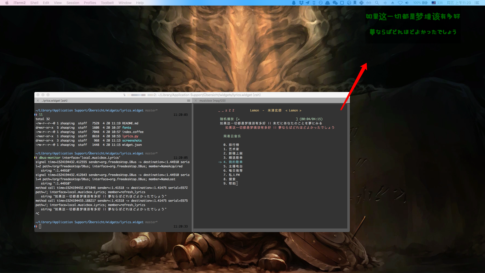

# OSX  网易云音乐歌词桌面显示插件

实现以壁纸形式显示歌词，~~通过调整 css~~ 实现样式自定义的功能

## 依赖环境
- [musicbox 网易云音乐的命令行版本](https://github.com/darknessomi/musicbox) , 要求具备 pyQt + dbus 环境。
- [Übersicht](http://tracesof.net/uebersicht/), OSX下使用 HTML 页面实现桌面的平台。
- dbus，进程间通讯途径。

## 实现机制
1. musicbox 通过 dbus 发送歌词 （给它自己 PyQt 写的歌词显示栏）
2. 插件调用 dbus-monitor 接收信息经过滤处理展示

## 其他问题

- musicbox 通过 Python 脚本实现，歌词展示中使用了 Qt4, 不与当前最新版 Qt5 兼容

  ​
